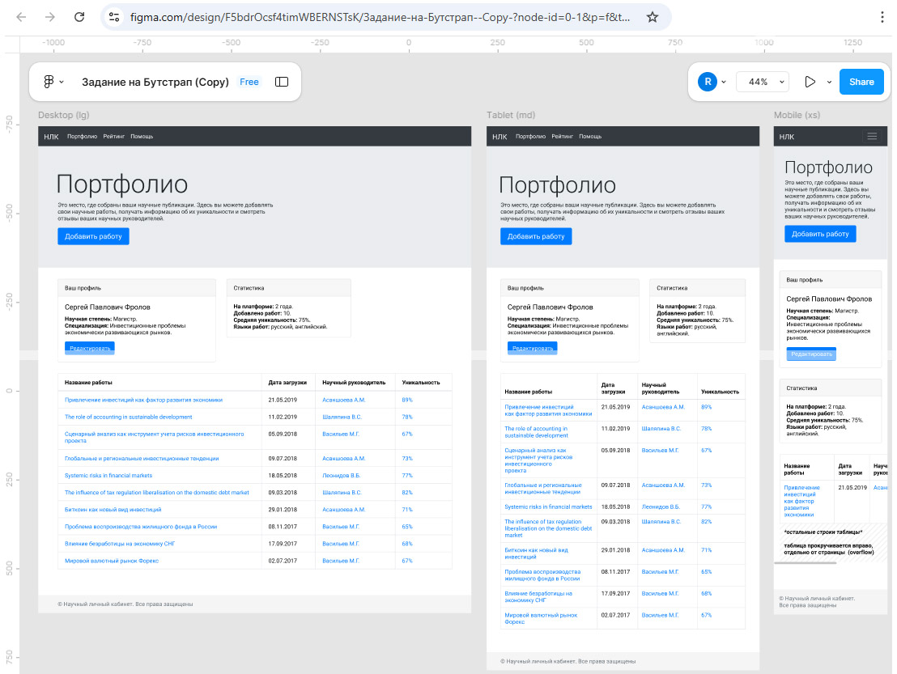
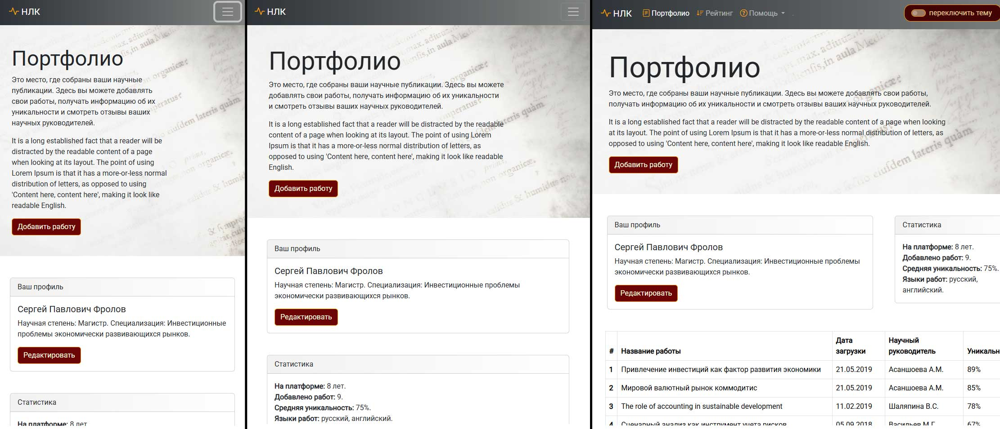
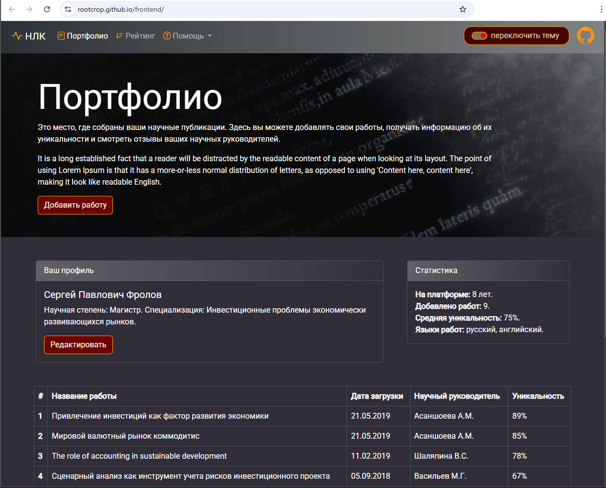

README.RU: Научный Личный Кабинет (НЛК) // [README.ENG : Scientific Personal Account (NLK)](https://github.com/rootcrop/nlk_frontend/blob/main/readme_eng.md)

# Описание проекта
Научный Личный Кабинет (НЛК) - это проект верстки и дизайна для веб-платформы управления научными публикациями

# Технологии
используемые технологии :
+ Frontend: HTML5, Bootstrap 5.3.8, JavaScript
+ Иконки: Bootstrap Icons
+ Шрифты: Google Fonts Roboto
+ Адаптивность: Полностью адаптивный дизайн для всех устройств

# Макет 

# Особенности
+ Адаптивность: Полностью адаптивный дизайн для свежих браузеров с изменяемыми классами/стилями/размерами
  
+ Анимированные элементы интерфейса
+ Кастомные стили кнопок и форм
+ Градиентные фоны и эффекты наведения
+ Темы: Поддержка светлой и темной тем
  

# Браузерная совместимость
Bootstrap 5.3.X поддерживает следующие минимальные версии браузеров
+ Chrome: ≥ 60
+ Firefox: ≥ 60 (включая Firefox ESR)
+ Safari/iOS: ≥ 12
+ Android Browser & WebView: ≥ 6.0
+ Microsoft Edge: поддерживаются последние стабильные версии
+ Opera: Поддерживаются последние стабильные версии

# Не поддерживает браузеры
- Opera Mini, Opera Mobile Turbo, UC Browser Mini, Amazon Silk
- Internet Explorer (IE): включая версии 10 и 11 (менее <2% пользователей)

Превью проекта: [rootcrop.github.io/frontend/](https://rootcrop.github.io/frontend/)
